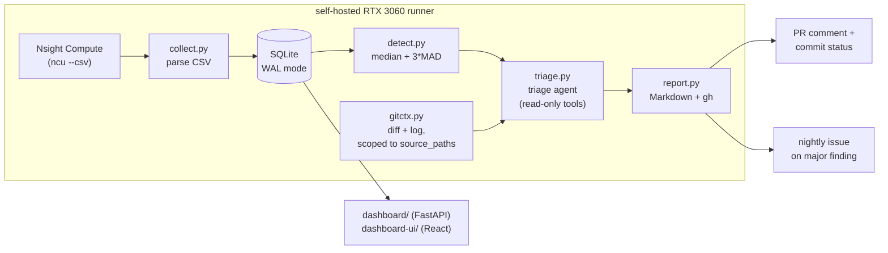

# PerfLens

A nightly CI system that catches and explains CUDA kernel performance
regressions. GitHub Actions on a self-hosted RTX 3060 runner profiles a
kernel suite with Nsight Compute, logs hardware metrics to SQLite, a
noise-aware statistical detector flags regressions against stored baselines,
and an LLM triage agent correlates the metric deltas with the kernel source
diff to produce a root-cause report that gates PRs.

The agent explains; it never auto-reverts or auto-merges. A human reads the
report and decides.

## Features

- Nsight Compute collection across a configurable kernel suite (`suite.yaml`),
  5 reps per kernel, results logged to SQLite
- Per-GPU baselines (median + MAD); comparisons across a different GPU or
  driver are refused rather than silently producing a misleading result
- Regression detection gated on both a relative-delta threshold and a noise
  floor (median + 3×MAD), so it neither fires on noisy kernels nor misses
  small, consistent regressions on stable ones
- A root-cause triage agent with four read-only tools -- findings, metric
  history, source diff, commit log -- backed by Claude or Groq
- Markdown reports, PR comments, and commit-status gating via `gh`
- A read-only FastAPI + React dashboard over the same SQLite store

## Case study: a caught regression

`paged_attention_kernel` in [`gpu-engine`](https://github.com/kanish10/LLM-Inference-Server/tree/main/gpu-engine)
was deliberately regressed on a
[`demo-regression` branch](https://github.com/kanish10/LLM-Inference-Server/commit/cec01a1):
128 per-thread running-sum accumulators were added, framed as debug
instrumentation for tracing a NaN back to its source key -- the kind of
change an engineer might genuinely make without weighing its register cost.

Run against a real RTX 3060, PerfLens's detector caught it:

```
[MINOR] inference.paged_attention/...paged_attention_kernel(...) duration_ns: 4416 -> 5024 (+13.77%)
```

`launch__registers_per_thread` went from 40 to 155 (+287.5%). Every other
suite entry was unaffected, confirming the regression was correctly isolated
to the one kernel that actually changed. Correctness held: 24/41 exact
top-1 token matches against the CPU oracle, unchanged from baseline.

The triage agent's report (Groq `openai/gpt-oss-120b` via
`perflens/groq_adapter.py`; Claude is the default backend, see "How the
triage agent works"):

> **Evidence:** duration_ns increased from 4416 to 5024 (+13.77%).
> regs_per_thread increased by +287.5%. dram throughput decreased by
> -1.024%. occupancy changed by +0.936%. L2 hit rate decreased by -2.459%.
> The diff adds a per-thread float array `chk[128]` and associated loops,
> which directly raises register usage.
>
> **Root-cause hypothesis:** The added diagnostic checksum array
> `float chk[128]` and its initialization/accumulation loops increase
> registers per thread by ~287%, causing register pressure and likely
> spills, leading to the observed ~14% runtime regression.
>
> **Confidence:** high
>
> **Next diagnostic step:** Run Nsight Compute with `--section=Registers
> --section=Spills` or `--set full` on `paged_attention_kernel` to verify
> register count and spill metrics, and examine `__launch_bounds__` or
> consider moving `chk` to shared memory or removing it.

Full report: [`reports/2026-08-23.md`](reports/2026-08-23.md).

Occupancy stayed essentially flat here rather than dropping -- this kernel's
block size already keeps it scheduling-bound, not register-bound, even at
155 registers/thread. The agent reported that correctly instead of assuming
the more common "registers up, occupancy down" pattern, and still correctly
attributed the slowdown to register-pressure and spill overhead adding raw
per-thread latency.

Running this end to end surfaced and fixed two real bugs, both with
regression tests: `collect.py`'s CSV parser assumed `ncu`'s stdout was pure
CSV, but `ncu`'s own progress messages and the profiled program's stdout are
interleaved with the `--csv` block; and `report.py` matched the agent's
narrative back to a finding on the full demangled kernel name, which a model
restating it doesn't always reproduce byte-for-byte -- it now matches on the
suite entry name instead, and the rendered severity always comes from the
detector rather than the agent's restatement of it. A stale `suite.yaml`
(wrong `kernel_regex`, source paths pointing at files that no longer existed,
a CLI flag `bench_decode` doesn't have) and a `gpu-engine` build bug (three
missing source files in `CMakeLists.txt`, so its CUDA path had never linked)
were also found and fixed along the way.

## Architecture



Design lineage: the statistical discipline (repeated trials against
nondeterminism, hermetic baselines) comes from a benchmark orchestrator built
for a prior project; the nightly-pipeline plumbing (Actions -> analyze ->
report) comes from an options-screener pipeline. PerfLens fuses both and
points them at GPU kernels.

## Repo layout

```
perflens/
  cli.py       perflens run|baseline|detect|triage|report|gate
  collect.py   ncu invocation + CSV parsing -> KernelResultRecord
  store.py     SQLite (WAL) schema + queries: runs, kernel_results, baselines
  detect.py    median + 3*MAD noise-aware regression/improvement detector
  triage.py    triage agent: read-only tools + strict-schema final report
  groq_adapter.py  Groq backend for triage.py (Claude is the default)
  report.py    Markdown rendering + gh PR comment / commit status
  gitctx.py    diffs and commit logs scoped to a suite entry's source_paths
  models.py    shared pydantic models
  dashboard/   FastAPI read-only API over the SQLite store
tests/         83 tests: synthetic detector cases, fixture CSV parsing,
                a stubbed-client triage run, a real temp git repo for
                gitctx, and full CLI wiring
dashboard-ui/  React + TypeScript dashboard
scripts/       demo_fixture_triage.py -- run the real agent on fixture data
.github/workflows/
  ci.yml        lint + type-check + test, every push/PR (GitHub-hosted)
  nightly.yml   the nightly collection + triage pipeline (self-hosted GPU runner)
  pr-gate.yml   the PR gate (self-hosted GPU runner, same-repo + label only)
reports/        generated Markdown lands here (nightly + PR runs)
suite.yaml      kernel suite manifest
```

## Quickstart

```bash
python3 -m venv .venv && source .venv/bin/activate
pip install -e ".[dev,dashboard]"

pytest                    # 83 tests, no GPU required
ruff check perflens tests
mypy perflens
```

Everything above runs on any machine. The commands below need a real NVIDIA
GPU with Nsight Compute (`ncu`) on `PATH`, and the sibling `gpu-engine` /
`cuda-ray-tracer` checkouts that `suite.yaml` points at:

```bash
perflens run --branch main                       # collect the whole suite
perflens baseline set --run 1                     # seed a baseline from run 1
perflens run --branch main                        # a second run to compare
perflens detect --run 2                           # print findings vs. baseline
perflens triage --run 2                           # needs ANTHROPIC_API_KEY or GROQ_API_KEY
perflens report --run 2 --nightly                 # render reports/YYYY-MM-DD.md
perflens gate --run 2 --pr 42                      # detect+triage+report+gate, exit 1 on major
```

`perflens triage`/`gate` don't take `--base-sha`/`--head-sha` in the normal
path -- each suite entry's own source commits are resolved automatically per
entry (see "How the triage agent works" below); those flags exist only to
force one explicit pair, which is only correct when every entry shares one
repo. `perflens --help` and `perflens <command> --help` document every flag.

## How detection works

For each `(entry, kernel)` in a run, compare the median `duration_ns` across
`suite.yaml`'s `reps` (5 by default) against a stored baseline median + MAD
(median absolute deviation). It's a **regression** iff *both*:

```
median_new > median_base * 1.05        # 5% relative-delta threshold
median_new > median_base + 3 * MAD_base  # noise-floor guard
```

Both gates matter: the first alone would flag a kernel with high natural
variance on every noisy run; the second alone would let a low-variance
kernel's real 3% regression slide by unflagged forever. Secondary metrics
(`occupancy_pct`, `dram_pct`, `l2_hit_pct`, `regs_per_thread`, block/grid
size, IPC) are attached as **diagnostic evidence only** -- they never gate a
finding by themselves, they just give the triage agent something to reason
about. The mirror condition on the other side flags an **improvement**, with
a suggested `perflens baseline set` command so the new normal gets adopted.
Baselines never compare across a different `gpu`/`driver` string -- that
comparison is silently skipped rather than producing a misleading finding.

`tests/test_detect.py` covers the cases this logic is held to: a clean 20%
regression is caught, 3% noise is not flagged, a kernel with naturally high
variance needs a proportionally bigger delta to trip the gate, and the
improvement path is exercised too.

## How the triage agent works

By default `triage.py` talks to Claude (`--model claude-*`, needs
`ANTHROPIC_API_KEY`). It can also talk to any Groq model (`--model` set to
anything else, e.g. `openai/gpt-oss-120b`, needs `GROQ_API_KEY` and the
`groq` extra: `pip install -e ".[groq]"`) via `perflens/groq_adapter.py`,
which translates between Anthropic's Messages-API tool-call shape and Groq's
OpenAI-compatible chat-completions shape on every call -- the agent loop is
written once, against the Anthropic shape, and doesn't need to know which
backend is actually running.

The agent gets four **read-only** tools -- `get_findings`,
`get_metric_history`, `get_kernel_diff`, `get_commit_log` -- all scoped to the
specific suite entry's `source_paths`, so it can never see a diff outside the
kernel that actually regressed. It never gets write access to the repo, the
database, or CI. Its final answer is forced through a `submit_triage_report`
tool with a strict JSON schema, so the output is always a validated Pydantic
`TriageReport`, never freeform prose a downstream renderer has to parse
hopefully. Only `regression` findings go to the agent -- an `improvement` has
no severity to report and no root cause to explain.

**Resolving the right source commits across sibling repos.** A suite entry's
kernel source doesn't live in this repo -- `suite.yaml`'s `cwd` points at a
sibling checkout (`../gpu-engine`, `../cuda-ray-tracer`), each with its own
independent commit history that shares no SHA namespace with this repo or
with each other. So `get_kernel_diff`/`get_commit_log` don't take `base_sha`/
`head_sha` as agent-supplied arguments -- the agent can't know the right
values for a repo it's never seen. Instead, `collect.py` records each entry's
own repo HEAD (`source_sha`) alongside every measurement at collection time,
and `TriageContext.resolve_shas` looks up, per entry: `head` = this run's
recorded `source_sha` for that entry, `base` = the `source_sha` recorded for
that entry in whichever run its baseline was set from. The agent just names
the `entry`; the correct commit pair for that entry's own repo comes back
automatically (`tests/test_triage.py::test_resolve_shas_uses_recorded_source_sha_not_this_repos_history`).

The system prompt asks for, per finding: severity (as set by the detector),
an evidence summary quoting exact metric deltas, a root-cause hypothesis tied
to a *specific* diff hunk or commit the agent actually saw via the tools, a
confidence level, and a next diagnostic step. If the diff can't explain the
delta, the agent is instructed to say so and hypothesize environment causes
(clock state, driver version, thermal throttling) rather than invent a code
change that isn't there.

## Self-hosted runner setup

`nightly.yml` and `pr-gate.yml` both require `runs-on: [self-hosted, gpu]`.

1. **The repo must be private, or PR-triggered self-hosted jobs must be
   restricted to same-repo branches.** `pr-gate.yml` checks
   `github.event.pull_request.head.repo.full_name == github.repository`
   before running anything, and is additionally label-gated (`perf`) so a
   maintainer has to opt a PR in -- this repo is currently public, so both
   layers matter, not just one.
2. **Run the runner as a dedicated non-admin user.** Don't reuse an existing
   login; create one scoped to this job (`sudo adduser --disabled-password
   perflens-runner`).
3. **Register the runner with the `gpu` label:**
   ```bash
   ./config.sh --url https://github.com/kanish10/PerfLens \
               --token <runner-registration-token> \
               --labels gpu --name rtx3060-runner
   ./svc.sh install perflens-runner
   ./svc.sh start
   ```
4. **Secrets:** `ANTHROPIC_API_KEY` and/or `GROQ_API_KEY` as repo secrets
   (Settings -> Secrets and variables -> Actions). `GITHUB_TOKEN` is provided
   automatically by Actions for the `gh` calls in `report.py`.
5. Install Nsight Compute and confirm profiling counters are accessible to
   `perflens-runner` (not just root) -- `perflens run` fails loudly with the
   exact fix (`NVreg_RestrictProfilingToAdminUsers=0` or a profiling group)
   if `ncu` exits nonzero for permission reasons. This needs a real VM or
   bare-metal box: container-based cloud GPU instances (including Vast.ai's
   default container type) don't grant the kernel-level access `ncu` needs --
   a VM instance type does.
6. Clone `gpu-engine` and `cuda-ray-tracer` as siblings of this repo's
   checkout on the runner box, matching the `cwd` paths in `suite.yaml`.

## Limitations

- **Cross-repo PR triggering isn't wired up.** `pr-gate.yml` triggers on PRs
  to *this* repo, but a real kernel regression lives in a commit to a
  *sibling* repo (`gpu-engine` or `cuda-ray-tracer`). `nightly.yml` sidesteps
  this by pulling each sibling's latest default-branch commit on its own
  schedule, but `pr-gate.yml` as written assumes the sibling checkouts are
  already sitting at the commit under test. The working assumption until this
  is built: either the sibling repo's own CI cross-triggers this workflow
  (`repository_dispatch`/`workflow_dispatch` with the target SHA), or a
  maintainer updates the sibling checkout by hand before applying the `perf`
  label. Triage itself is correct regardless of how the sibling repo got to
  that commit -- it's specifically the cross-repo trigger plumbing that's
  unbuilt.
- **Unattended nightly operation isn't proven over multiple nights yet.** The
  pipeline itself has run end to end on real hardware (the case study above);
  what's unverified is a self-hosted runner staying online through repeated
  unattended cron firings, which is an operational question rather than one
  about the pipeline's correctness.
- **Wall-clock ingestion isn't built.** `bench_decode`'s own CSV output
  (app-level throughput, distinct from `ncu`'s kernel-level durations) isn't
  ingested as a second PerfLens channel yet.

## Dashboard

`perflens/dashboard/api.py` is a small read-only FastAPI service over the
same SQLite file `perflens run` writes to -- no separate data pipeline.
`dashboard-ui/` is a React + TypeScript frontend for it. See
[`dashboard-ui/README.md`](dashboard-ui/README.md) for how to run both
together locally.

## License

MIT, see [`LICENSE`](LICENSE).
